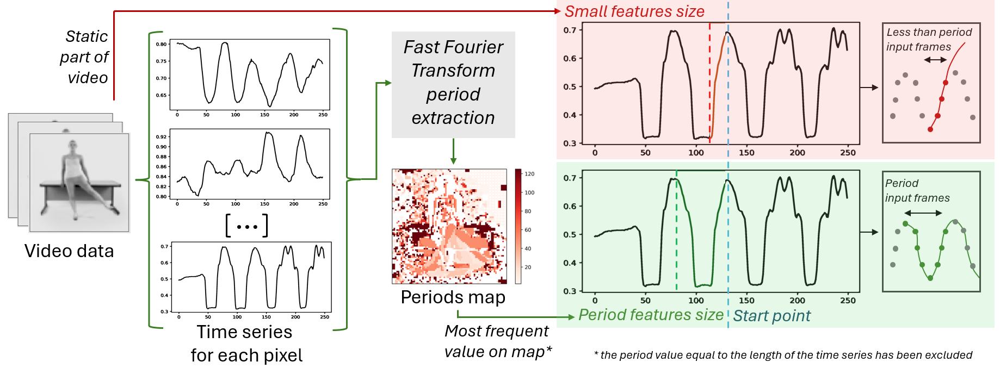

# Towards importance of periodicity estimation in long-term spatio-temporal data prediction - IJCNN 2025

___

## Content
___
This repo contains code and results of experiments with two types of predictive models for spatio-temporal data:
[CNN model](CNN) and [Diffusion model](Diffusion).

For each type of model experimental setup with five types of data was provided:
 
- KTH dataset - videos that contains six actions: walk, jog, run, box, hand-wave, and hand clap;
- MovingMnist -  in each video sequence two digits move independently around the frame;
- WeatherBench - benchmark dataset for data-driven weather forecasting.
[WeatherBenchLoader](https://github.com/ChrisLisbon/WeatherBenchLoader) tool 
was used to touch dataset;
- Sea ice concentration - OSISAF provider dataset;
- Loop video - simple synthetic periodic video example.

The main goal of the experiments is correct usage of periodic component of spatio-temporal data as a 
prehistory (input frame number) for forecast. To explorate the period of data period map for sequence with 
FFT transform can be used. Examples of building period maps for sea ice and loop video presented in 
[period_map.py](period_map.py).

___
## Period map
Visualization of period map and scheme of its usage for forecasting:

 - example of periodic video.

___
## Models
___

**CNN model** used in experiments was implemented with [TorchCNNBuilder](https://github.com/ChrisLisbon/TorchCNNBuilder) tool for automatic 
resolution for automatic assimilation of different data resolutions. 

**Diffusion model** was implemented in basic configuration with keynotes from [paper](https://arxiv.org/pdf/2301.10972).

**Baselines** were implemented as naive forecasts: mean 5 years for natural datasets (sea ice, WeatherBench), 
last element for media data.

___
## Results
___

### **Sea Ice Concentration case**

### **Loop video case**

 - source gif image

___
## Source materials

Paper text present main goal, extensive results and conclusion of the work. 

Additional information can be found in supplementary materials. 